# Advanced Lane Finding Using OpenCV
**In this project, I used OpenCV to write a software pipeline to identify the lane boundaries in a video from a front-facing camera on a car.**

## Pipeline architecture:
- **Compute Camera Calibration.**
- **Apply Distortion Correction**.
- **Apply a Perspective Transform.**
- **Create a Thresholded Binary Image.**
- **Define the Image Processing Pipeline.**
- **Detect Lane Lines.**
- **Determine the Curvature of the Lane and Vehicle Position.**
- **Visual display of the Lane Boundaries and Numerical Estimation of Lane Curvature and Vehicle Position.**
- **Process Project Videos.**

I'll explain each step in details below.

#### Environement:
-  Ubuntu 16.04
-  Anaconda 5.0.1
-  Python 3.6.2
-  OpenCV 3.1.0

---
## Step 1: Compute Camera Calibration

The OpenCV functions `cv2.findChessboardCorners()` and `cv2.drawChessboardCorners()` are used for image calibration. We have 20 images of a chessboard, located in `./camera_cal`, taken from different angles with the same camera, and we'll use them as input for camera calibration routine.

`cv2.findChessboardCorners()` attempts to determine whether the input image is a view of the chessboard pattern and locate the internal chessboard corners, and then `cv2.drawChessboardCorners()` draws individual chessboard corners detected.

Arrays of object points, corresponding to the location of internal corners of a chessboard, and image points, the pixel locations of the internal chessboard corners determined by `cv2.findChessboardCorners()`, are fed to `cv2.drawChessboardCorners()` which returns camera calibration and distortion coefficients.

These will then be used by the OpenCV `cv2.calibrateCamera()` to find the camera intrinsic and extrinsic parameters from several views of a calibration pattern. These parameters will be fed to `cv2.undistort` function to correct for distortion on any image produced by the same camera.

---
## Step 2: Apply Distortion Correction

OpenCV provides `cv2.undistort` function, which transforms an image to compensate for radial and tangential lens distortion.

<figure>
 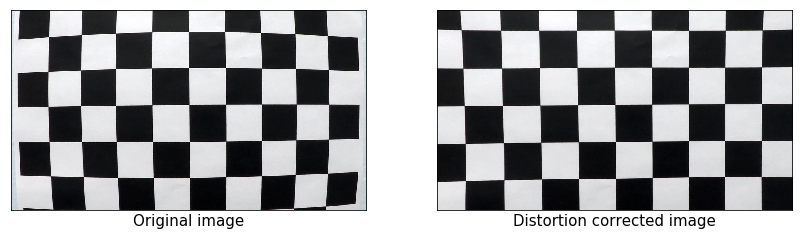
 <figcaption>
 

 
 </figcaption>
</figure>

<figure>
 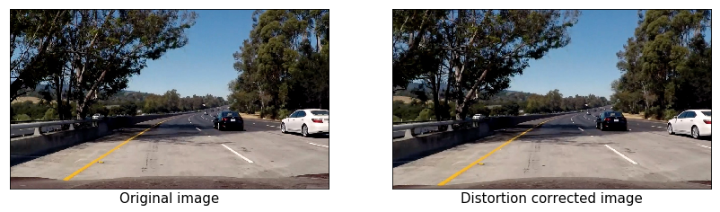
 <figcaption>
 

 
 </figcaption>
</figure>

The effect of `undistort` is particularly noticeable, by the change in shape of the car hood at the bottom corners of the image.

---
## Step 3: Apply a Perspective Transform

A common task in autonomous driving is to convert the vehicle’s camera view of the scene into a top-down “bird’s-eye” view. We'll use OpenCV's `cv2.getPerspectiveTransform()` and `cv2.getPerspectiveTransform()` to do this task.
(Starting from line #174 in `model.py`)

<figure>
 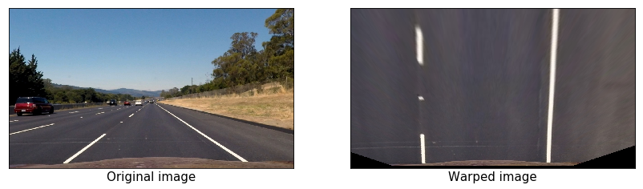
 <figcaption>
 

 
 </figcaption>
</figure>

<figure>
 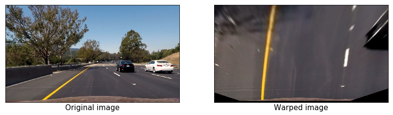
 <figcaption>
 

 
 </figcaption>
</figure>

<figure>
 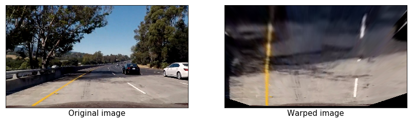
 <figcaption>
 

 
 </figcaption>
</figure>

---
## Step 4: Create a Thresholded Binary Image

Now, we will use color transform and Sobel differentiation to detect the lane lines in the image.
(Starting from line #247 in `model.py`)

### Exploring different color spaces

#### RGB color space:

<figure>
 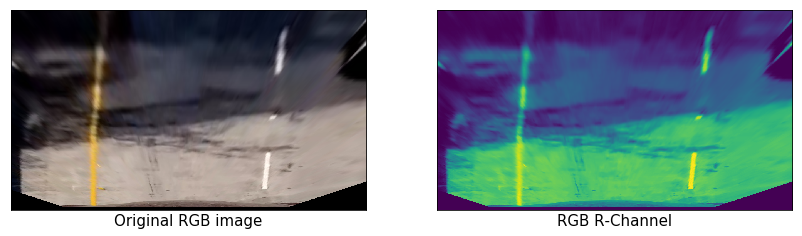
 <figcaption>
 

 
 </figcaption>
</figure>

<figure>
 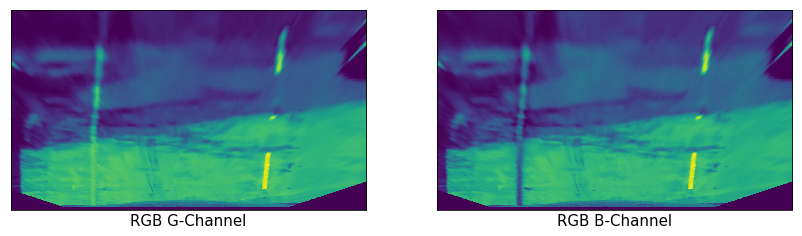
 <figcaption>
 

 
 </figcaption>
</figure>

#### HSV color space:
This type of color model closely emulates models of human color perception. While in other color models, such as RGB, an image is treated as an additive result of three base colors, the three channels of HSV represent hue (H gives a measure of the spectral composition of a color), saturation (S gives the proportion of pure light of the dominant wavelength, which indicates how far a color is from a gray of equal brightness), and value (V gives the brightness relative to
the brightness of a similarly illuminated white color) corresponding to the intuitive appeal of tint, shade, and tone.

<figure>
 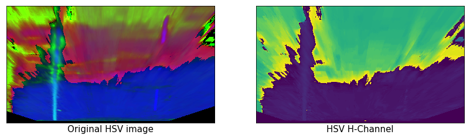
 <figcaption>
 

 
 </figcaption>
</figure>

<figure>
 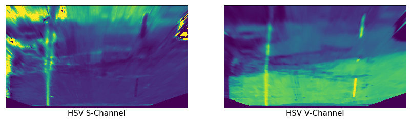
 <figcaption>
 

 
 </figcaption>
</figure>

#### LAB color space:
The Lab color space describes mathematically all perceivable colors in the three dimensions L for lightness and a and b for the color opponents green–red and blue–yellow.

<figure>
 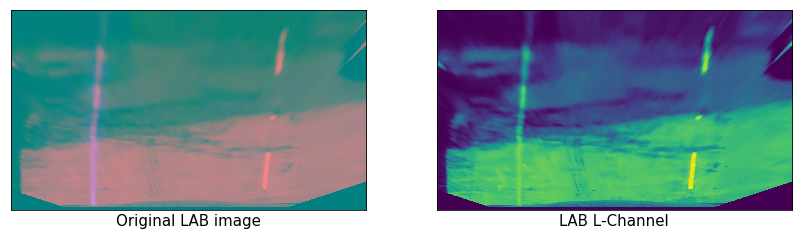
 <figcaption>
 

 
 </figcaption>
</figure>

<figure>
 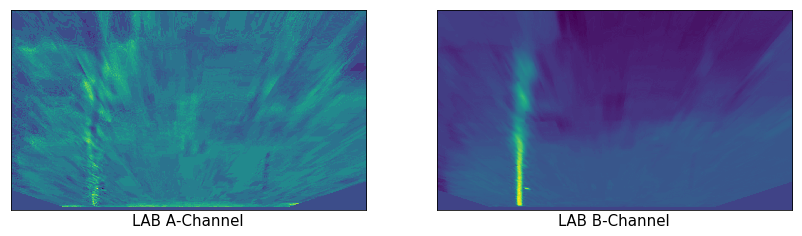
 <figcaption>
 

 
 </figcaption>
</figure>

#### HLS color space:
This model was developed to specify the values of hue, lightness, and saturation of a color in each channel. The difference with respect to the HSV color model is that the lightness of a pure color defined by HLS is equal to the lightness of a medium gray, while the brightness of a pure color defined by HSV is equal to the brightness of white.

<figure>
 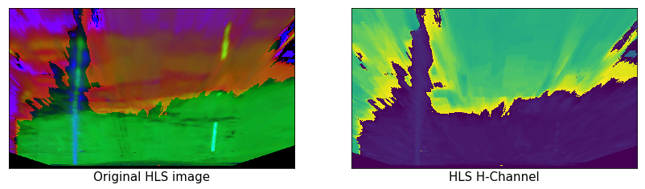
 <figcaption>
 

 
 </figcaption>
</figure>

<figure>
 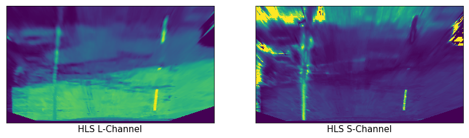
 <figcaption>
 

 
 </figcaption>
</figure>

### Color Space Thresholding

As you may observe, the white lane lines are clearly highlighted in the L-channel of the of the HLS color space, and the yellow line are clear in the L-channel of the LAP color space as well. We'll apply HLS L-threshold and LAB B-threshold to the image to highlight the lane lines.

<figure>
 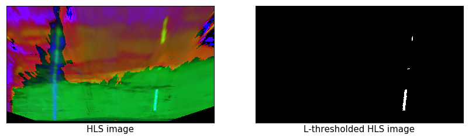
 <figcaption>
 

 
 </figcaption>
</figure>

<figure>
 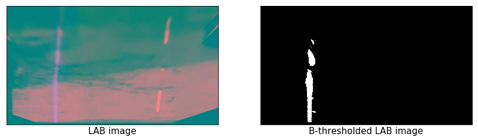
 <figcaption>
 

 
 </figcaption>
</figure>

<figure>
 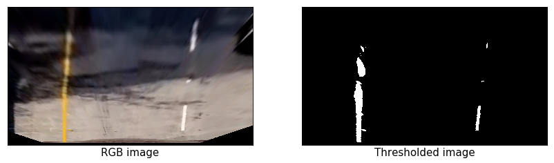
 <figcaption>
 

 
 </figcaption>
</figure>

### Sobel Differentiation

Now, we'll explore different Sobel differentiation techniques, and try to come up with a combination that produces a better output than color space thresholding.

#### Absolute Sobel:

<figure>
 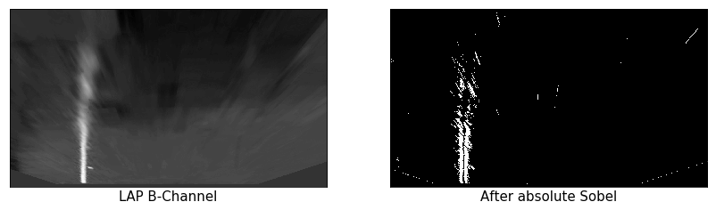
 <figcaption>
 

 
 </figcaption>
</figure>

<figure>
 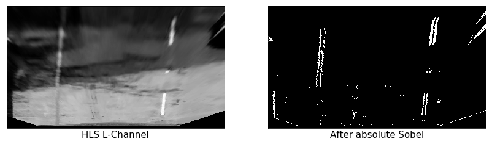
 <figcaption>
 

 
 </figcaption>
</figure>

#### Magnitude Sobel:

<figure>
 
 <figcaption>
 

 
 </figcaption>
</figure>

<figure>
 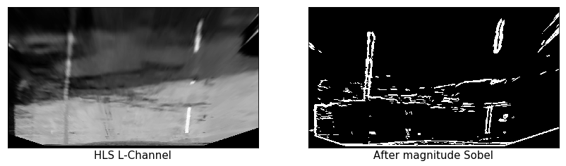
 <figcaption>
 

 
 </figcaption>
</figure>

#### Direction Sobel:

<figure>
 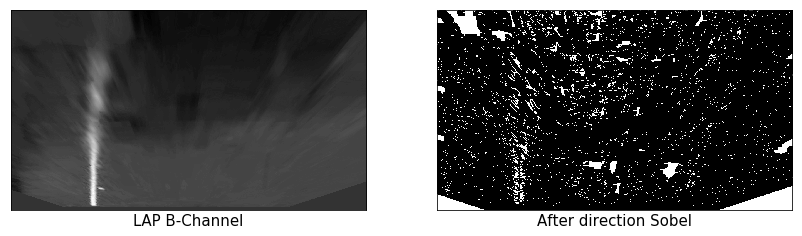
 <figcaption>
 

 
 </figcaption>
</figure>

<figure>
 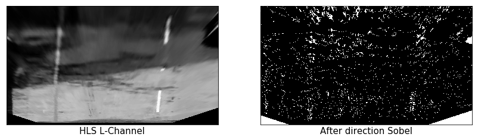
 <figcaption>
 

 
 </figcaption>
</figure>

#### Absolute+Magnitude Sobel:

<figure>
 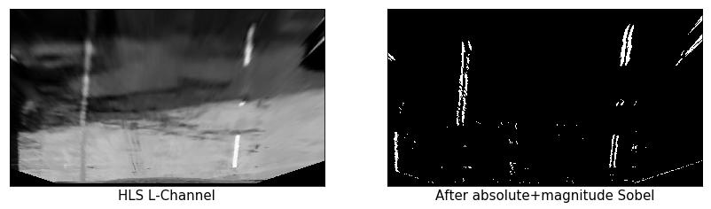
 <figcaption>
 

 
 </figcaption>
</figure>

<figure>
 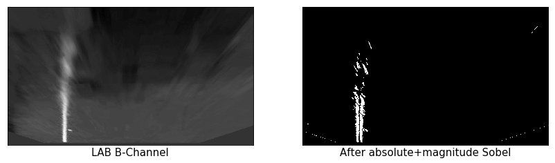
 <figcaption>
 

 
 </figcaption>
</figure>

<figure>
 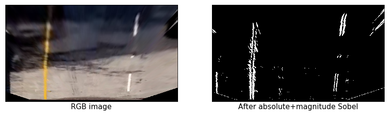
 <figcaption>
 

 
 </figcaption>
</figure>

### Comparison between Color Thresholding and Sobel Diffrentiation

We'll apply both color thresholding and Sobel diffrentiation to all the test images to explore which of these two techniques will be better to do the task.

<figure>
 
 <figcaption>
 

 
 </figcaption>
</figure>

<figure>
 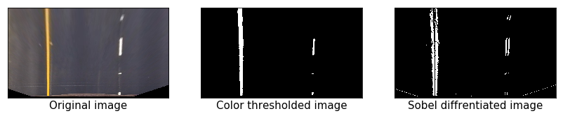
 <figcaption>
 

 
 </figcaption>
</figure>

<figure>
 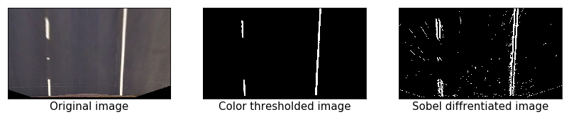
 <figcaption>
 

 
 </figcaption>
</figure>

<figure>
 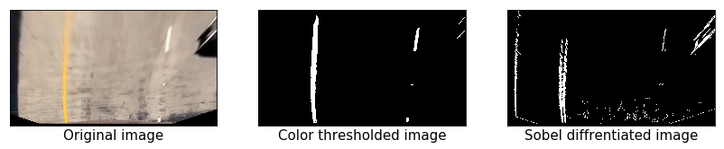
 <figcaption>
 

 
 </figcaption>
</figure>

<figure>
 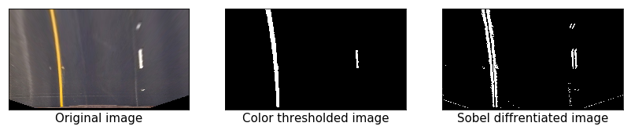
 <figcaption>
 

 
 </figcaption>
</figure>

<figure>
 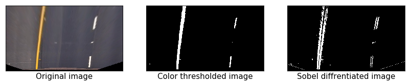
 <figcaption>
 

 
 </figcaption>
</figure>

<figure>
 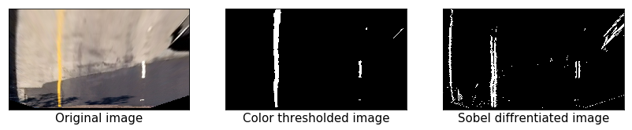
 <figcaption>
 

 
 </figcaption>
</figure>

<figure>
 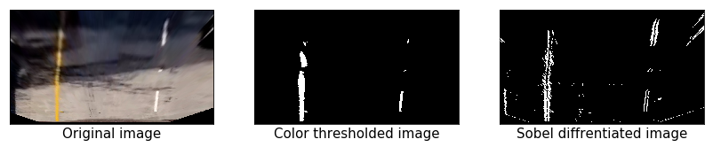
 <figcaption>
 

 
 </figcaption>
</figure>

<figure>
 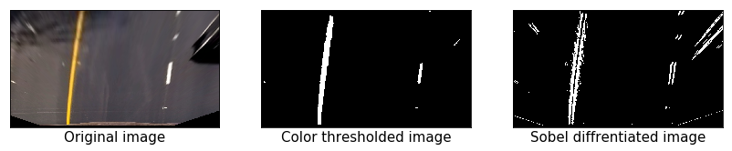
 <figcaption>
 

 
 </figcaption>
</figure>

As you can see, although Sobel diffrentiation was able to capture the lane lines correctly, it captured some noise around it. On the other hand, color thresholding was able to produce clean output highlighting the lane lines.

---
## Step 5: Define the Image Processing Pipeline

Now, we'll define the complete image processing function to read the raw image and apply the following steps:
1. Distortion Correction.
2. Perspective Transform.
3. Color Thresholding.

<figure>
 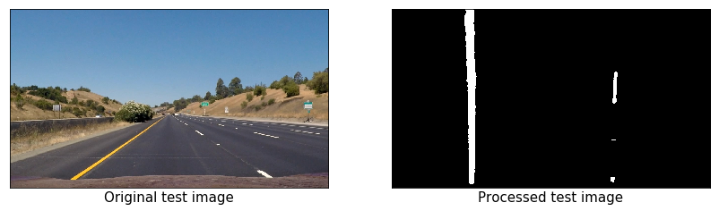
 <figcaption>
 

 
 </figcaption>
</figure>

<figure>
 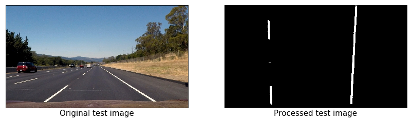
 <figcaption>
 

 
 </figcaption>
</figure>

<figure>
 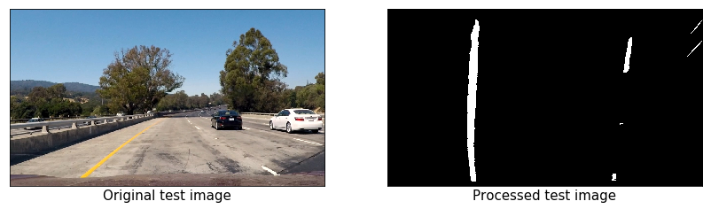
 <figcaption>
 

 
 </figcaption>
</figure>

<figure>
 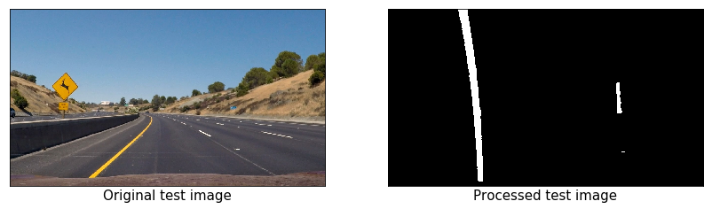
 <figcaption>
 

 
 </figcaption>
</figure>

<figure>
 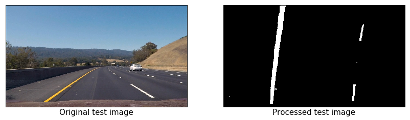
 <figcaption>
 

 
 </figcaption>
</figure>

<figure>
 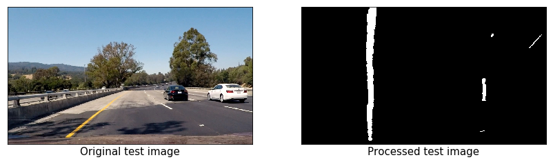
 <figcaption>
 

 
 </figcaption>
</figure>

<figure>
 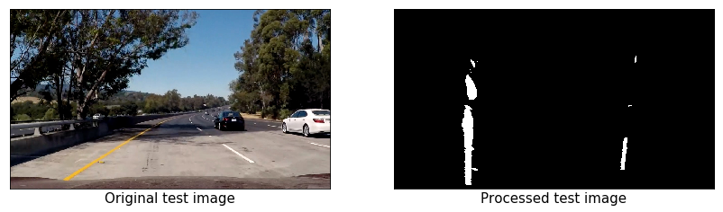
 <figcaption>
 

 
 </figcaption>
</figure>

<figure>
 
 <figcaption>
 

 
 </figcaption>
</figure>

---
## Step 6: Detect the Lane Lines

After applying calibration, thresholding, and a perspective transform to a road image, we should have a binary image where the lane lines stand out clearly. However, we still need to decide explicitly which pixels are part of the lines and which belong to the left line and which belong to the right line.
(Starting from line #651 in `model.py`)

### Sliding Window Search

We'll compute a histogram of the bottom half of the image and find the base of the left and right lane lines. Originally these locations were identified from the local maxima of the left and right halves of the histogram, but in the final implementation we used quarters of the histogram just left and right of the midpoint. This helped to reject lines from adjacent lanes. The function identifies 50 windows from which to identify lane pixels, each one centered on the midpoint of the pixels from the window below. This effectively "follows" the lane lines up to the top of the binary image, and speeds processing by only searching for activated pixels over a small portion of the image.

<figure>
 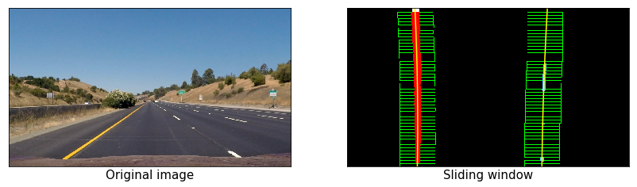
 <figcaption>
 

 
 </figcaption>
</figure>

<figure>
 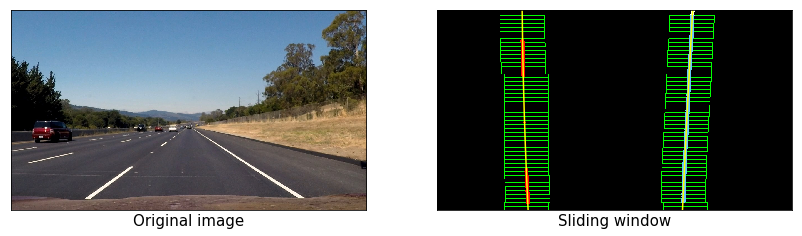
 <figcaption>
 

 
 </figcaption>
</figure>

<figure>
 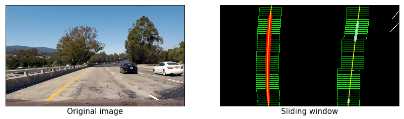
 <figcaption>
 

 
 </figcaption>
</figure>

<figure>
 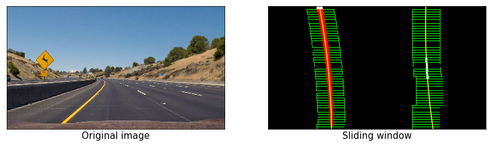
 <figcaption>
 

 
 </figcaption>
</figure>

<figure>
 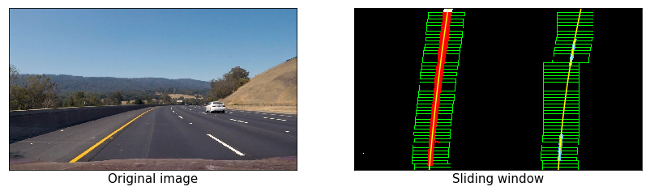
 <figcaption>
 

 
 </figcaption>
</figure>

<figure>
 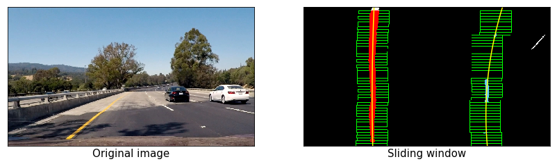
 <figcaption>
 

 
 </figcaption>
</figure>

<figure>
 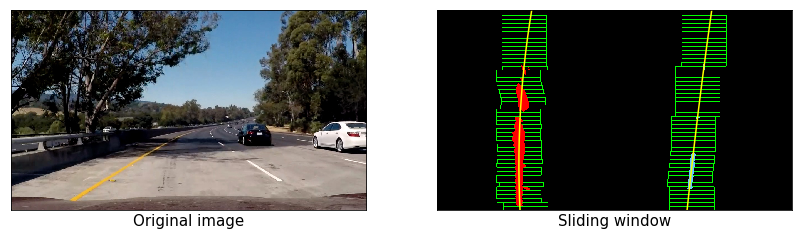
 <figcaption>
 

 
 </figcaption>
</figure>

<figure>
 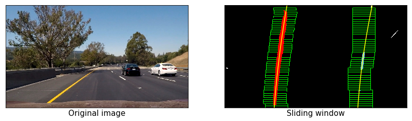
 <figcaption>
 

 
 </figcaption>
</figure>

### Polyfit Using Fit from Previous Frame

The Polyfit Using Fit from Previous Frame is another way that performs basically the same task, but alleviates much difficulty of the search process by leveraging a previous fit (from a previous video frame, for example) and only searching for lane pixels within a certain range of that fit. 

<figure>
 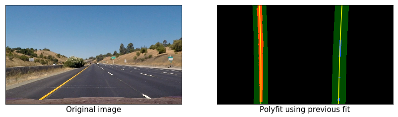
 <figcaption>
 

 
 </figcaption>
</figure>

<figure>
 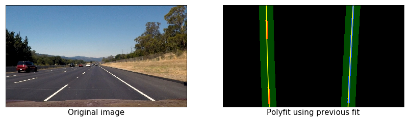
 <figcaption>
 

 
 </figcaption>
</figure>

<figure>
 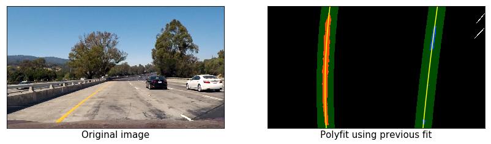
 <figcaption>
 

 
 </figcaption>
</figure>

<figure>
 
 <figcaption>
 

 
 </figcaption>
</figure>

<figure>
 
 <figcaption>
 

 
 </figcaption>
</figure>

<figure>
 
 <figcaption>
 

 
 </figcaption>
</figure>

<figure>
 
 <figcaption>
 

 
 </figcaption>
</figure>

<figure>
 
 <figcaption>
 

 
 </figcaption>
</figure>

---
## Step 7: Determine the Curvature of the Lane and Vehicle Position

(Starting from line #972 in `model.py`)

I've depended on this [tutorial](https://www.intmath.com/applications-differentiation/8-radius-curvature.php) to calculate the lane curvature. The curvature was calculated ussing this line of code:

`curve_radius = ((1 + (2*fit[0]*y_0*y_meters_per_pixel + fit[1])**2)**1.5) / np.absolute(2*fit[0])`

In this example, fit[0] is the first coefficient (the y-squared coefficient) of the second order polynomial fit, and fit[1] is the second coefficient. y_0 is the y position within the image upon which the curvature calculation is based. y_meters_per_pixel is the factor used for converting from pixels to meters. This conversion was also used to generate a new fit with coefficients in terms of meters.

The position of the vehicle with respect to the center of the lane is calculated with the following lines of code:

`lane_center_position = (r_fit_x_int + l_fit_x_int) /2
center_dist = (car_position - lane_center_position) * x_meters_per_pix`

r_fit_x_int and l_fit_x_int are the x-intercepts of the right and left fits, respectively. This requires evaluating the fit at the maximum y value because the minimum y value is actually at the top. The car position is the difference between these intercept points and the image midpoint (assuming that the camera is mounted at the center of the vehicle).

---
## Step 8: Visual display of the Lane Boundaries and Numerical Estimation of Lane Curvature and Vehicle Position

<figure>
 
 <figcaption>
 

 
 </figcaption>
</figure>

<figure>
 
 <figcaption>
 

 
 </figcaption>
</figure>

<figure>
 
 <figcaption>
 

 
 </figcaption>
</figure>

<figure>
 
 <figcaption>
 

 
 </figcaption>
</figure>

<figure>
 
 <figcaption>
 

 
 </figcaption>
</figure>

<figure>
 
 <figcaption>
 

 
 </figcaption>
</figure>

<figure>
 
 <figcaption>
 

 
 </figcaption>
</figure>

<figure>
 
 <figcaption>
 

 
 </figcaption>
</figure>

---
## Step 9: Process Project Videos

**Processing the project video (Sample output):**

---
## Conclusion

The problems I encountered were almost exclusively due to lighting conditions, shadows, discoloration, etc. It wasn't difficult to detect the lane on the project video, even on the lighter-gray bridge sections that comprised the most difficult sections of the video.

On the other hand, the model didn't perform well on the challenge video and the harder challenge. The lane lines don't necessarily occupy the same pixel value (speaking of the L channel of the HLS color space) range on this video that they occupy on the first video, so the normalization/scaling technique helped here quite a bit, although it also tended to create problems (large noisy areas activated in the binary image) when the white lines didn't contrast with the rest of the image enough.
This would definitely be an issue in snow or in a situation where, for example, a bright white car were driving among dull white lane lines.
One way to solve this issue is to apply smoothing to the video output by averaging the last n found good fits. We can also invalidate fits if the left and right base points aren't a certain distance apart (within some tolerance) under the assumption that the lane width will remain relatively constant.

Other ways to improve the model include more dynamic thresholding, perhaps considering separate threshold parameters for different horizontal slices of the image, or dynamically selecting threshold parameters based on the resulting number of activated pixels, designating a confidence level for fits and rejecting new fits that deviate beyond a certain amount, or rejecting the right fit (for example) if the confidence in the left fit is high and right fit deviates too much (enforcing roughly parallel fits).
